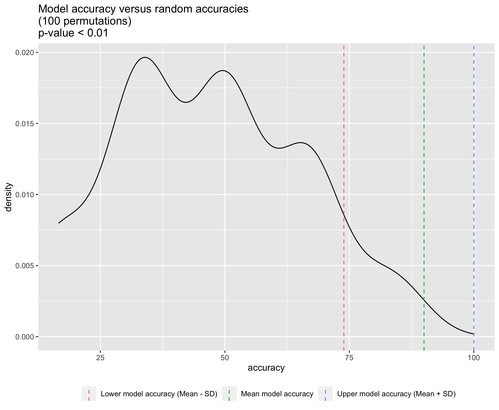

# Random Forest metabolite selection

Tools:
* ranger

## Random Forest model accuracy
The Random Forest model has an accuracy of 90% -/+ 16.1. (74% - 100%). 

Comparison to a distribution of random RF model accuracies (N = 1000 permutations):  

## Significant candidates

Table  

Plots of their abundance in the 4 genotypes. 