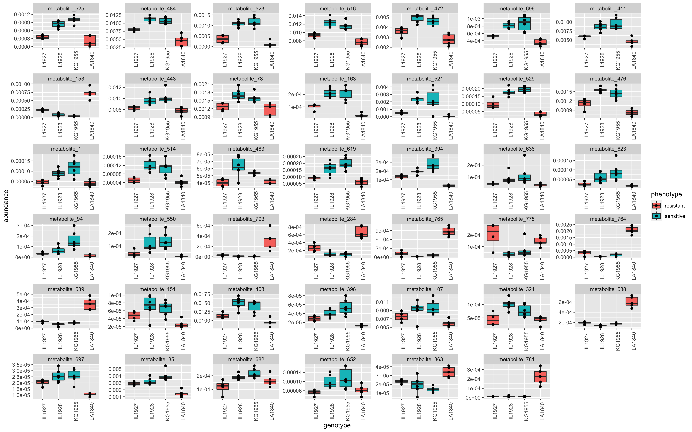
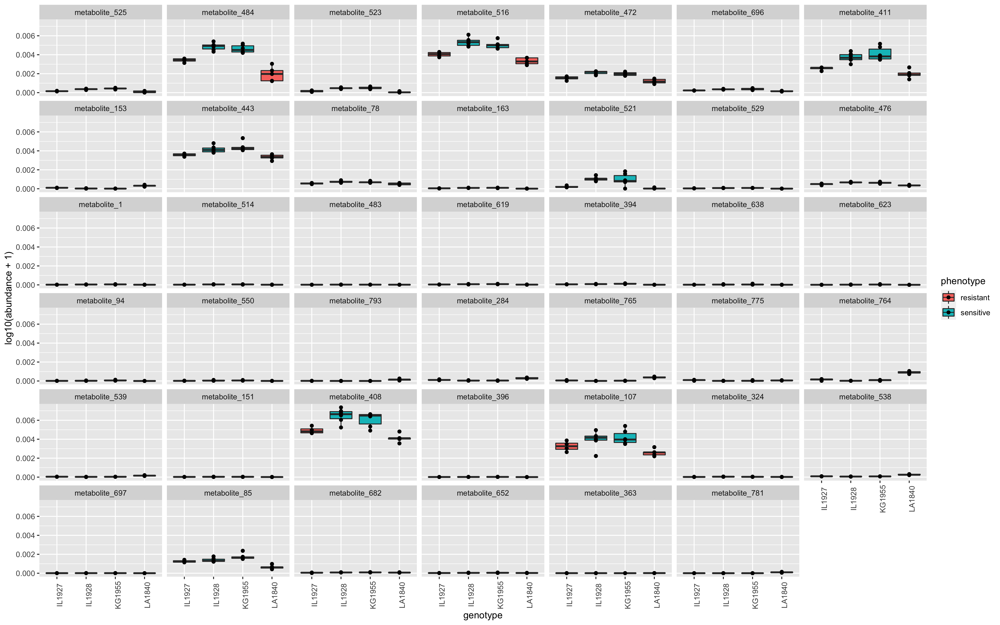

# Random Forest metabolite selection

Tools:
* ranger

## Random Forest model accuracy
The Random Forest model has an accuracy of 90% -/+ 16.1. (74% - 100%). 

Comparison to a distribution of random RF model accuracies.

## Significant candidates (own scaling)

Classified by highest variable importance to lowest. 
All candidates significant (e.g. p < 0.01 if 100 permutations).

## Significant candidates (own scaling)

## Table of candidates

[Final candidates are in this .csv table](./final_candidates.csv)