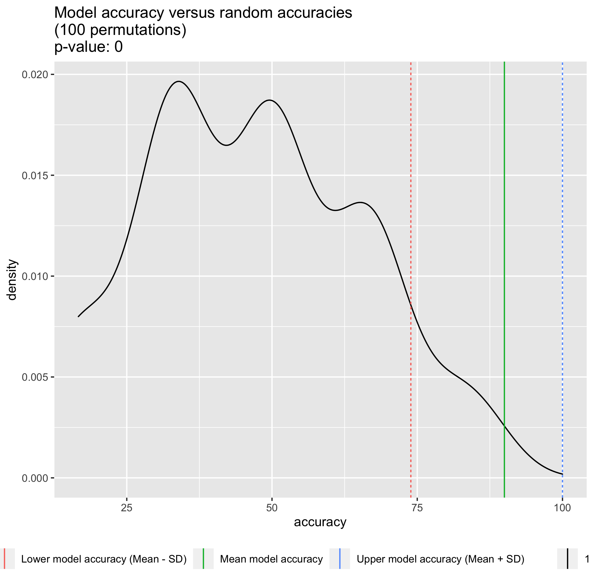

# Random Forest metabolite selection

Tools:
* ranger

## Random Forest model accuracy
The Random Forest model has an accuracy of 90% -/+ 16.1. (74% - 100%). 

Comparison to a distribution of random RF model accuracies.

## Significant candidates (own scaling)

Classified by highest variable importance to lowest. 
All candidates significant (e.g. p < 0.01 if 100 permutations).

## Significant candidates (own scaling)

# Tables 

## Table of all candidates (sensitive + resistant)

[All final candidates are in this .csv table](./final_candidates.csv)  

## Table of resistant candidates

[Candidates associated with resistance are in this .csv table](./candidates_more_abundant_in_resistant.csv) and shown below.    

| metabolite     	| resistant            	| sensitive            	|
|----------------	|----------------------	|----------------------	|
| metabolite_153 	| 0.000503030777777778 	| 5.522375e-05         	|
| metabolite_793 	| 0.000193352444444444 	| 1.10733333333333e-05 	|
| metabolite_284 	| 0.000491115777777778 	| 0.000104655833333333 	|
| metabolite_765 	| 0.000539593555555556 	| 3.76083333333333e-05 	|
| metabolite_775 	| 0.000167874111111111 	| 5.284075e-05         	|
| metabolite_764 	| 0.00129358233333333  	| 0.000110564333333333 	|
| metabolite_539 	| 0.000240321666666667 	| 6.73333333333333e-05 	|
| metabolite_538 	| 0.000419326777777778 	| 0.000155493          	|
| metabolite_363 	| 2.91666666666667e-05 	| 1.68508333333333e-05 	|
| metabolite_781 	| 0.00013208           	| 1.19158333333333e-05 	|